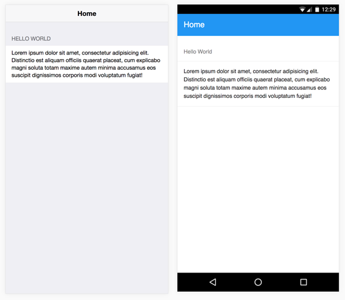
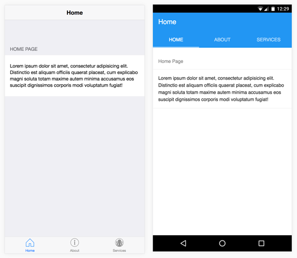
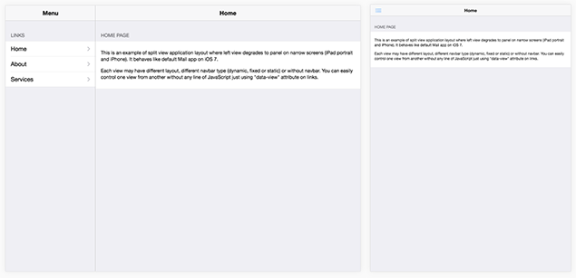
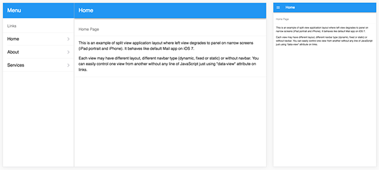

# Project Overview

This app is based on a PhoneGap Framework7 Vue template. The PhoneGap Framework7 Vue templates provide a boilerplate app to help developers get started building mobile apps quickly. There are currently three template layouts to choose from:

1. [Blank](https://www.npmjs.com/package/phonegap-template-vue-f7-blank)

  

1. [Tabs](https://www.npmjs.com/package/phonegap-template-vue-f7-tabs)

  

1. [Split Panel](https://www.npmjs.com/package/phonegap-template-vue-f7-split-panel)

   iOS

   Android

The templates each have a similar project structure, based off the [vue-pwa-webpack template](https://github.com/vuejs-templates/pwa) and are configured with Cordova/PhoneGap, Vue.js, Framework7, Webpack, Babel, ESLint and Hot Reloading as well as Progressive Web App support. They also have unit tests and CSS extraction built-in.

The Adobe Stockpile App uses the Split Panel template and you will learn how to specifically use it to get started in lesson 1.

## Project Structure

Before moving on, below is a quick overview of the project structure you should see. This will be similar for each of the PhoneGap templates, and is a combination of the [vue-pwa-webpack template](https://github.com/vuejs-templates/pwa) and a PhoneGap CLI created project.

A quick note about the contents of each asset is noted in the comments, but you can also refer to the [Vue Webpack template project docs](https://github.com/vuejs-templates/webpack/blob/develop/docs/structure.md) for specific details.

```text
.
├── build/                      # webpack config files
│   └── ...
├── config/
│   ├── index.js                # main project config
│   └── ...
├── src/
│   ├── main.js                 # app entry file
│   ├── routes.js               # defines simple routing between paths and components
│   ├── App.vue                 # main app component
│   ├── components/             # ui components
│   │   └── ...
│   └── assets/                 # module assets (processed by webpack)
│       └── ...
├── static/                     # pure static assets (directly copied)
├── test/
│   └── unit/                   # unit tests
│   │   ├── specs/              # test spec files
│   │   ├── index.js            # test build entry file
│   │   └── karma.conf.js       # test runner config file
│   └── e2e/                    # e2e tests
│   │   ├── specs/              # test spec files
│   │   ├── custom-assertions/  # custom assertions for e2e tests
│   │   ├── runner.js           # test runner script
│   │   └── nightwatch.conf.js  # test runner config file
├── .babelrc                    # babel config
├── .postcssrc.js               # postcss config
├── .eslintrc.js                # eslint config
├── .editorconfig               # editor config
├── config.xml                  # PHONEGAP config file
├── hooks                       # PHONEGAP hooks folder
├── platforms                   # PHONEGAP platforms folder
├── plugins                     # PHONEGAP plugins folder
├── www                         # PHONEGAP default project folder (build output goes here)
└── package.json                # build scripts and dependencies
```

## www

When the project is initially created, the `www` folder will include a sample PhoneGap Hello World application by default. Once you run the build commands however, the `www` will get overwritten each time. Once built, the `www/index.html` file specifically represents the final template `index.html` for the single page application. During development and builds, Webpack will generate assets, and the URLs for those generated assets will be automatically injected into this index.html template to render the final HTML. DO NOT MODIFY the contents of the `www` folder or `www/index.html` file. All of your updates will be done in the `src` folder instead.

## src/main.js

The main entry point to the app. Contains the overall dependency imports, platform detection code and globals for the app as well as the [Vue initialization](https://vuejs.org/v2/guide/instance.html) code.

## src/index.html

Contains the meta tags for things like Content Security Policy, Progressive Web App elements (meta tags for cross browser PWA support, manifest.json and service-worker.js references and `<noscript>...</noscript>` block etc), the `cordova.js` include and the main `app` div where the app is finally rendered.

## src/App.vue

Defines the overall app UI structure, platform detection code, `backButton` handler and `deviceready` handler.

## src/routes.js

Sets up basic routing for each of the templates. A **route** is what a single page app uses to determine what page to display based on a mapping between a path (URL) and a *.vue component. The `src/components/*` folders contain [single file Vue components](https://vuejs.org/v2/guide/single-file-components.html) which encapsulate the functionality needed to display a view when a route is matched. This includes the UI elements, JavaScript and CSS all in one file.

## About this Guide

The Split Panel template provides a good app structure to get started with since it already includes a navigation bar, some basic views, a side menu and page routing wired up. Since the Stockpile app needs this as well, it's easier to re-use existing pages and content where possible. For each of the views you may notice a similar high-level pattern of changes that need to occur:

1. Update the view routing
1. Update the UI for the view
1. Implement the JavaScript for the view updates

> The split panel template automatically expands the left panel into a split view when the app is run on a device larger than a phone.

## Next: [Project Creation & Setup](./01-project-creation.html.md)
